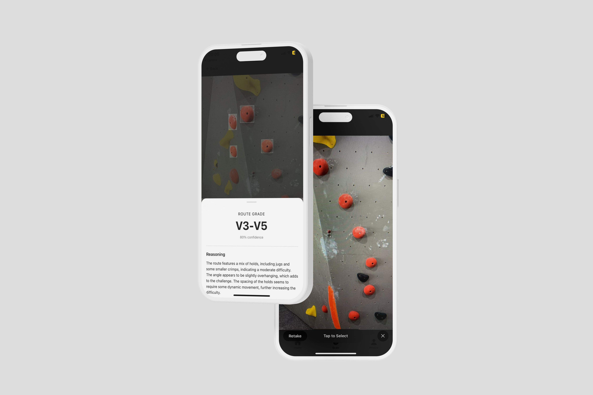
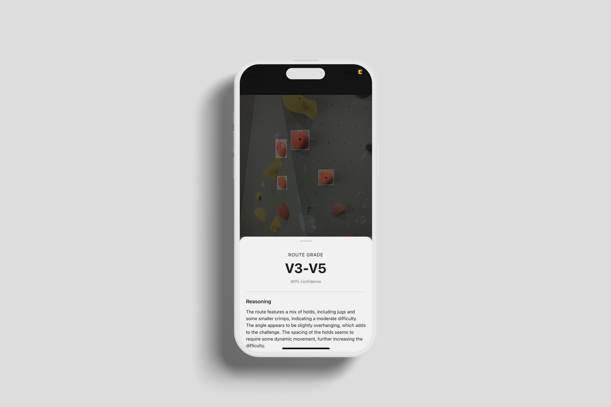
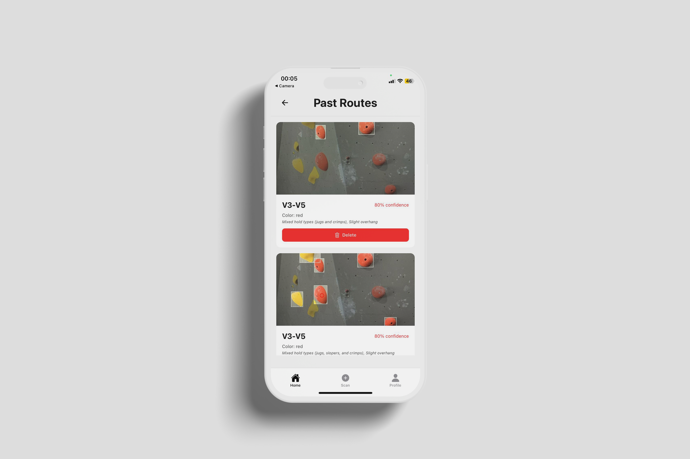
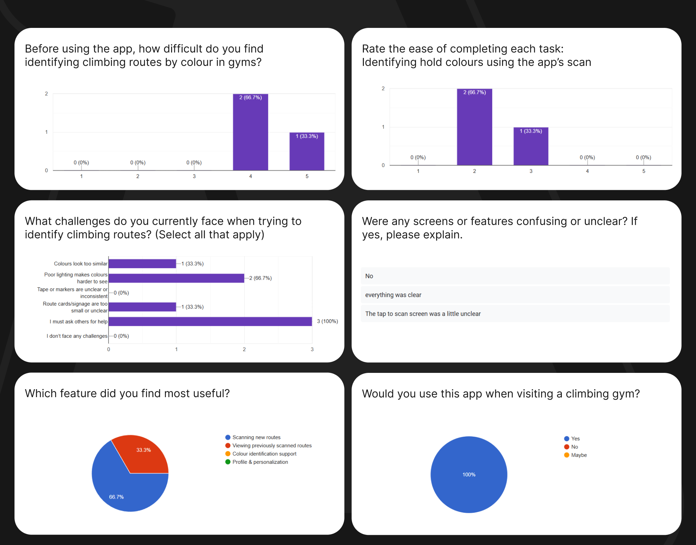

<h4 align="center"> A cross-platform mobile climbing route assistant</h4>

## 

<h1 align="center">AscendAI</h1>
<h4 align="center">Frontend Repo • <a href="https://github.com/KurtSchwimmbacher/AscendBackend.git">Backend Repo</a></h4>

<details>
<summary>📑 <strong>Table of Contents</strong> (Click to expand)</summary>

1. <a href="#about-the-project"><strong>About The Project</strong></a>  
   ↳ 1.1 <a href="#11-project-description">Project Description</a>  
   ↳ 1.2 <a href="#12-built-with">Built With</a>
2. <a href="#getting-started"><strong>Getting Started</strong></a>  
   ↳ 2.1 <a href="#21-prerequisites">Prerequisites</a>  
   ↳ 2.2 <a href="#22-how-to-install">How to Install</a>
3. <a href="#features--usage"><strong>Features & Usage</strong></a>
4. <a href="#demonstration"><strong>Demonstration</strong></a>
5. <a href="#architecture--system-design"><strong>Architecture / System Design</strong></a>
6. <a href="#unit-testing--user-testing"><strong>Unit Testing & User Testing</strong></a>
7. <a href="#highlights--challenges"><strong>Highlights & Challenges</strong></a>
8. <a href="#roadmap--future-implementations"><strong>Roadmap & Future Implementations</strong></a>
9. <a href="#contributing--licenses"><strong>Contributing & Licenses</strong></a>
10. <a href="#authors--contact-info"><strong>Authors & Contact Info</strong></a>
11. <a href="#acknowledgements"><strong>Acknowledgements</strong></a>
</details>

---

## About The Project

A Modern, Cross-Platform Climbing Route Assistant

### 1.1 Project Description

AscendAI is a mobile app that helps boulderers detect routes by colour, annotate holds, and estimate route grades using computer vision and AI. Built with Expo/React Native for iOS/Android, it integrates a FastAPI backend for hold detection and analysis, and Firebase for auth, storage and persistency. Users can scan, review, save, and manage past routes with notes and manual grade overrides.

Key capabilities:

- Route detection by colour from a single photo with precise tap-to-image mapping
- Annotated image generation (bounding boxes, optional tap marker)
- Automatic route grade estimation with reasoning and confidence
- Persistent “Past Routes” with image storage in Firebase Storage and metadata in Firestore
- Profile management with username and profile picture
- Simple, responsive UI with bottom tab navigation

### 1.2 Built With

**Frontend**  
React Native (Expo) • TypeScript • React Navigation • Axios

**Backend**  
FastAPI • Python • Pillow • (YOLO hold detection service) • Render

**Cloud**  
Firebase Auth • Firestore • Firebase Storage

**Tooling**  
Expo Image Picker • Expo Image Manipulator

---

## Getting Started

### 2.1 Prerequisites

- Node.js 18+
- Expo CLI
- iOS Simulator/Xcode (macOS) or Android Studio/Emulator
- Firebase project (Auth, Firestore, Storage)
- Backend API (FastAPI) deployed (e.g., Render)

Optional:

- nvm for Node version management

### 2.2 How to Install

1. Clone the repository

```bash
git clone <your-frontend-repo-url>
cd AscendAI
```

2. Install dependencies

```bash
npm install
npx expo install expo-image-picker expo-image-manipulator
```

3. Configure environment

- Set API URL in app config (Expo Constants extra) or `.env`:
  - `API_URL=https://ascendbackend-b2f7.onrender.com`
- Ensure `services/firebase.ts` is configured with your Firebase keys (Auth/Firestore/Storage).

4. Run the app

```bash
npx expo start
# press 'i' for iOS simulator or 'a' for Android emulator,
# or scan the QR with Expo Go on a device
```

---

## Features & Usage

### 🚀 Core Features

- Scan Route (Camera → Photo → Press-and-hold to select colour → Scan)
  - Precise coordinate mapping for resizeMode="contain"
  - Loading overlay while detection runs
  - Annotated image displayed on return
    
- Grade Reading
  - Kicks off after annotation, shows grade, confidence, reasoning and key factors
    
- Past Routes
  - Saves annotated image to Firebase Storage
  - Saves metadata (grade, detection summary, timestamps, notes, manual grade) to Firestore
  - Browse cards, view details, edit (name/notes/manual grade), and delete
    
- Profile
  - Username and profile picture upload (Firebase Storage)
  - Edit name, username, DOB, phone; delete account (removes profile, routes, and storage)
    

### 🧭 Navigation

- Bottom tabs (Home, Scan, Profile)
- Auth/onboarding flow before tabs are shown

---

## Demonstration

📹 **[Watch Demo Video](https://drive.google.com/file/d/12Mv9FZuAK4SjZkUlvpzggjBInWlw0bGV/view?usp=sharing)**

_A walkthrough of the app's core features including route scanning, grade detection, and route management._

---

## Architecture / System Design

High-level:

- React Native app (Expo) communicates with FastAPI
- Image capture → optional front-end normalization (expo-image-manipulator)
- Detection endpoint returns selected colour, detections, and optional annotated image URL
- After successful detection, annotated image is uploaded to Firebase Storage; route metadata is saved to Firestore
- Grade analysis endpoint returns v-grade, confidence, reasoning, key factors, and model metadata
- Past routes UI reads from Firestore; detail screen allows editing and manual grade override
- Profile uses Firebase Auth; profile picture stored in Firebase Storage

Key modules:

- `services/routeDetectionService.ts` – detect-by-colour API
- `hooks/detectRouteHook.ts` – detection hook
- `services/gradeService.ts` & `hooks/readHook.ts` – grade analysis
- `services/storageService.ts` – upload/delete images (routes, profiles)
- `services/firestoreService.ts` – user profiles, routes CRUD
- `pages/ScanRoute.tsx` – scan flow
- `components/ScannedRouteDisplay.tsx` – annotated image & grade sheet
- `pages/PastRoutes.tsx` & `pages/RouteDetailScreen.tsx` – management & edits
- `pages/ProfileScreen.tsx` – user info, edit, delete
- `navigation/MainTabs.tsx` & `navigation/HomeStack.tsx` – navigation

---

## User Testing

### 👥 User Testing

Method: Moderated observational exploratory usability test (unstructured tasks). Participants freely explored the app while I observed in-session, followed by a post-test Google Form survey.

#### Key Insights



One of the biggest frustrations surrounding rock climbing is needing to ask others for help identifying holds. Every user felt the app was successful in solving this pain.

The least clear screen to use was the Scan a Route screen, the rest of the app was intuitive and structured. Users felt the app was either totally or somewhat successful in clarifying what holds were legal in a route.

Key insights: Either an onboarding mode to clarify/demonstrate the scan screen is required or the UI must be updated to better reflect the desired behavior.

---

## Highlights & Challenges

### Highlights

- Robust multipart/form-data handling, long-running timeouts (up to 180s)
- Precise tap mapping for letterboxed images
- Clean separation of concerns: services/hooks/UI
- Full persistence: Storage for images, Firestore for metadata

### Challenges

- Fine tuning colour detection
- 422 errors from mismatched `Content-Type` and body/query formats
- Client-side timeouts vs server processing time
- EXIF/rotation issues – solved via minimal image manipulation

---

## Roadmap & Future Implementations

- Video walkthroughs and in-app guidance
- Advanced colour filtering tolerance controls
- Re-analyse grade for saved routes
- Batch scans and albums
- Offline caching of recent routes
- Social sharing and community boards
- More robust analytics (most common grades, gym trends)

---

## Contributing & Licenses

> This project was developed as part of a university course requirement and is currently private and non-commercial.  
> No external contributions are being accepted at this time.

---

## Authors & Contact Info

Built with ❤️ by:

- **Kurt Schwimmbacher**

---

## Acknowledgements

- React Native & Expo teams for cross-platform tooling
- FastAPI community for excellent async Python APIs
- Firebase for rapid auth, storage, and database capabilities
- Open-source CV tooling and YOLO ecosystems for hold-detection foundations
- **Open Window Lecturer Armand Pretorius** for providing feedback and insight
